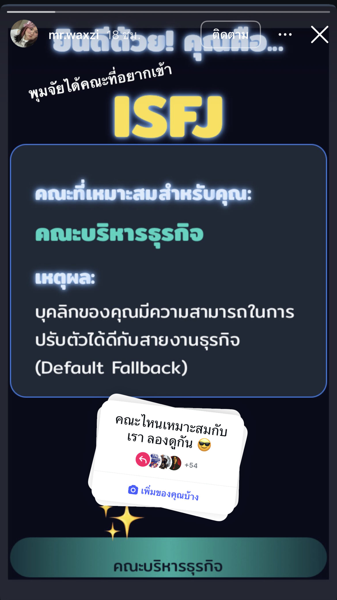
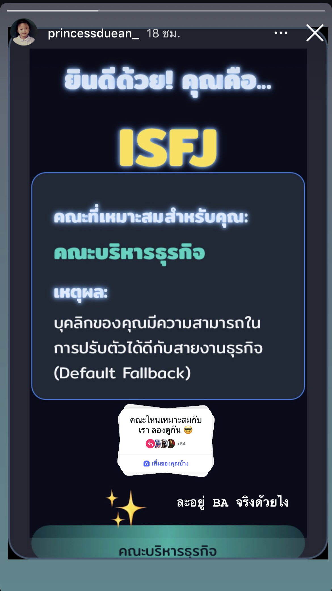
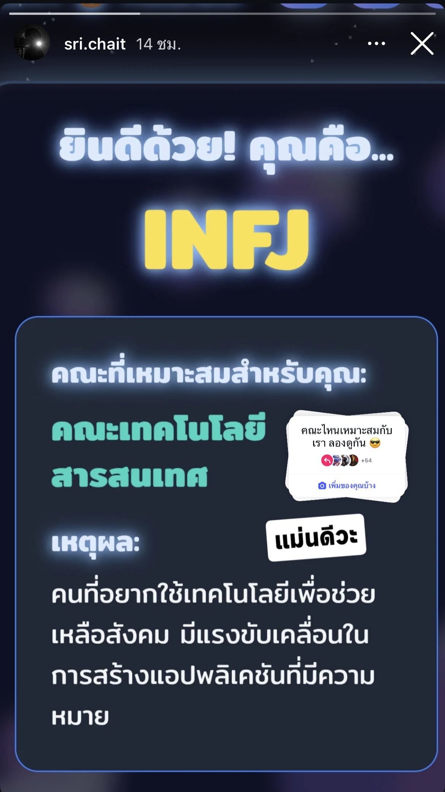
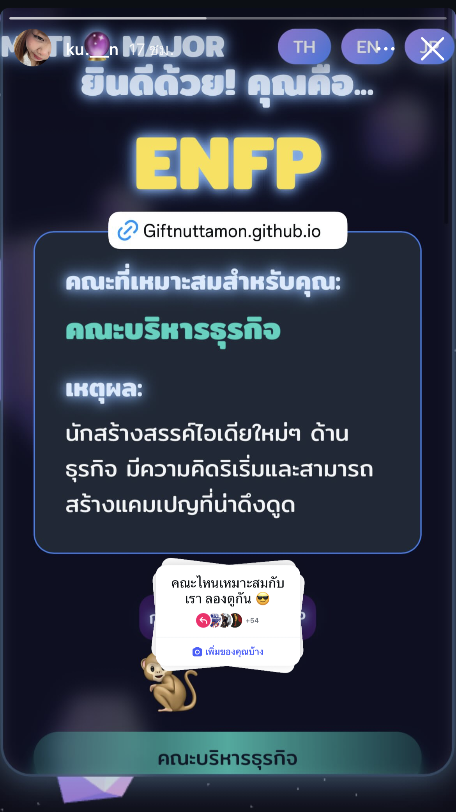

# 🔮 MBT(N)I x คณะที่ใช่  
เข้าเล่นที่ >> https://giftnuttamon.github.io/MBTIxTNI/ 
> 🎓 โครงการนี้พัฒนาโดย (กิ๊ฟ) นางสาวนัทธมน จันทร์สีดา CE15 2211310764 นักศึกษาวิศวกรรมคอมพิวเตอร์ TNI  

## 📊 ติดตามจำนวนผู้เล่น
👉 [ดูสถิติบน Instagram Story](https://www.instagram.com/s/aGlnaGxpZ2h0OjE4Mjc3MDE0MzM3MjcxNDA0?story_media_id=3733692394731302909&igsh=ZGxpZjk5MDVzbjcw)

  
  

  
  

---

## 🌟 คุณสมบัติ (Features)
- แบบทดสอบ MBTI ออนไลน์ (12 ข้อคำถาม)  
- แนะนำคณะที่เหมาะสม 🎯  
- รองรับ 3 ภาษา: 🇹🇭 ไทย | 🇬🇧 อังกฤษ | 🇯🇵 ญี่ปุ่น  
- เอฟเฟกต์สวยงามด้วย **Three.js** และ UI สไตล์ *Fantasy* ✨  
- แชร์ผลลัพธ์ไปยัง Facebook / Instagram  

---

## 🚀 การใช้งาน (Usage)
1. กรอกชื่อเล่น อายุ และเลือกเพศ  
2. ทำแบบทดสอบ MBTI ทั้งหมด  
3. รับผลลัพธ์ **MBTI type** + คณะที่เหมาะสม  
4. กดปุ่ม **แชร์** เพื่อบันทึก/ส่งต่อ  

---

## 🛠️ เทคโนโลยีที่ใช้ (Tech Stack)
- HTML5 / CSS3 / Tailwind CSS  
- JavaScript (Vanilla)  
- Three.js (3D Background & Animation)  
- html2canvas (Screenshot & Sharing)  

---

## 📌 เกี่ยวกับโครงการ
โครงการนี้เป็นส่วนหนึ่งของการสหกิจศึกษา **Computer Engineering – TNI**  
เพื่อพัฒนาทักษะ **Web Development, UI/UX, และ Responsive Design**  

---

## ❤️ Credits
- พัฒนาโดย: [Nuttamon Chanseeda](https://github.com/GiftNuttamon)   

---
⭐ อย่าลืมกด Star เพื่อเป็นกำลังใจนะคะ!
